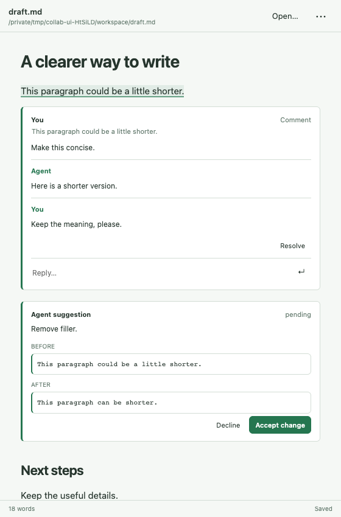
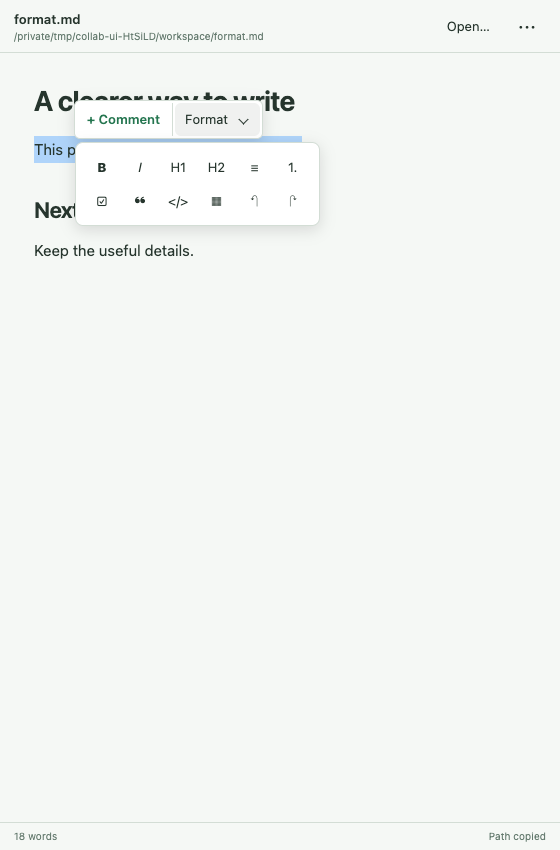
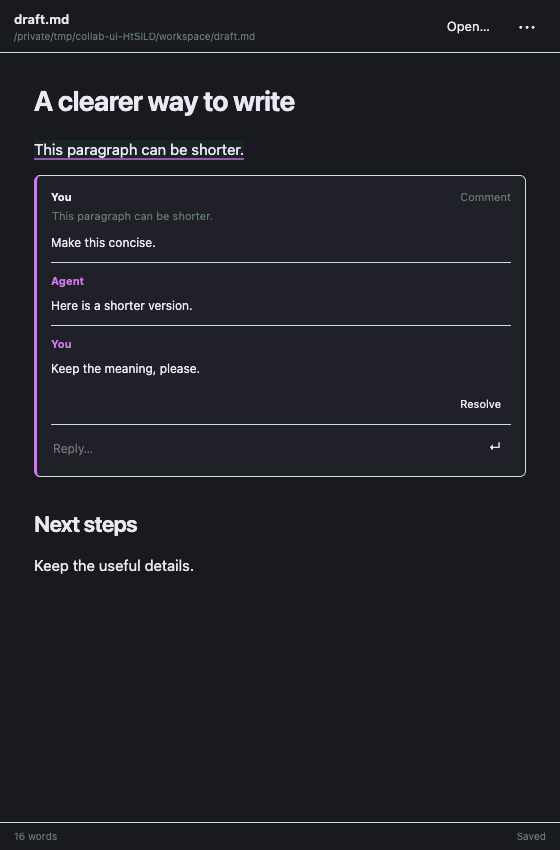

# Collab

> [!IMPORTANT]
> **Temporary requirement: run OpenClaw from `main`.** Build and run OpenClaw at commit [`721523b1de6b`](https://github.com/openclaw/openclaw/commit/721523b1de6bbef9ab8e8def71580eeef6f1962d) or a later commit on `main`. This commit merged [PR #163428](https://github.com/openclaw/openclaw/pull/163428), which adds the APIs Collab needs to open its panel. Builds without these APIs fail when opening documents through the agent or an “Open in Collab” link.
>
> **ClawHub publishing is on hold until an OpenClaw release includes these changes.** The source is available here in the meantime.

**Write with your agent. Keep control of the document.**

Collab is a Markdown editor for [OpenClaw](https://github.com/openclaw/openclaw). Open a workspace file, highlight a passage, and leave a comment. Your agent replies and suggests changes right beside the text. You accept or decline each suggestion.

It lives in the session side panel, so the conversation and the document stay together. You can also open it as a full page from the main sidebar.



*A comment, a reply, and a proposed edit in the real editor. Screenshots use sample documents.*

## What you can do

- **Comment on a passage.** Select text and choose **+ Comment**. Saved comments and your replies go to the agent in the same session automatically.
- **Review edits in place.** See the original and proposed text together. Choose **Accept change** to apply the suggestion.
- **Work with your files.** Open workspace Markdown, save a draft as a new file, or rename a file without losing its comments and suggestions.
- **Write and format.** Use headings, emphasis, lists, tasks, quotes, code, tables, links, and images. Typing stays local; saving waits for a short pause.
- **Keep your place.** Each session has its own active document. Switching files preserves their review history.

No separate collaboration account, paid service, or remote editor backend is required. Comments are delivered through your existing OpenClaw agent session.

## Try it

**Development preview:** Collab is available from source, not ClawHub or npm. Use the OpenClaw `main` build described above and follow [Build from source](#build-from-source). The published `2026.9.7` version number alone does not establish compatibility.

Once installed, enable **Settings → Labs → Custom plugin UI** in OpenClaw, then:

1. Open a session and choose **Side panel → Collab**.
2. Choose **Open…** to select a workspace Markdown file, or start with the session draft.
3. Highlight a passage and choose **+ Comment** (`⌘/Ctrl + Alt + M`).
4. Leave feedback. The agent's reply and proposed edit appear inline.
5. Choose **Accept change** or **Decline**.

You can also ask: “Open `notes/draft.md` in Collab.” The agent can open the side panel and read the active document.

### Formatting and file controls

Select text to reveal **+ Comment** and **Format**. Expand **Format** for the editing toolbar.



The **•••** menu includes **Save as…**, **Download Markdown**, and **Copy Collab link**. Click a filename to rename it; click the path below it to copy the full path. Save as and rename never overwrite an existing file. Download Markdown includes your unsaved edits.

Collab follows your Control UI theme, including live theme changes.

<details>
<summary>Dark theme</summary>



</details>

## How edits and data work

Workspace Markdown stays in its original file. Collab keeps comments, suggestions, and document state under `<OpenClaw state>/collab/documents/`. Review cards are never inserted into the Markdown file.

| Agent tool | Purpose |
| --- | --- |
| `collab_read` | Read the active document, path, revision, and review history |
| `collab_open` | Open a workspace Markdown file in the session side panel |
| `collab_create` | Initialize an untouched session draft |
| `collab_reply` | Reply to a comment thread |
| `collab_propose` | Suggest an exact Markdown replacement |

There is no Collab agent tool for accepting a suggestion. Acceptance requires a writable UI session. This approval boundary applies to Collab tools; it does not remove any separate filesystem tools your agent already has.

Revision checks prevent silent overwrites from another view or an external file edit. Missing or ambiguous passages cannot receive a proposed replacement. Comments follow edits; removed or ambiguous quotes are not silently attached to different text. Failed feedback delivery offers **Retry** without losing the saved comment.

Unsaved drafts are retained in browser storage at save boundaries and when the panel closes. Recovery is separate for each file. **Reload saved version** downloads your local draft before loading the saved text.

## Build from source

Use a Node.js version supported by your OpenClaw checkout and a **built, compatible OpenClaw development checkout**. Collab treats OpenClaw as an optional peer dependency so installing editor dependencies does not install a second Gateway. OpenClaw is still required to build and run the plugin.

```sh
git clone https://github.com/openclaw/collab.git
cd collab
npm ci

# Link your built OpenClaw checkout without changing the shared lockfile.
npm run link:host -- /absolute/path/to/openclaw

npm run check
npm test
npm run build
npm run validate
./node_modules/.bin/openclaw plugins install --link .
```

Use the linked checkout's CLI for installation and validation; another `openclaw` on PATH may have an older plugin schema. Install into the intended Gateway configuration. This repo does not rebuild or restart your host.

For browser verification, install Google Chrome and run `npm run test:ui`. Set `COLLAB_BROWSER_EXECUTABLE` to use a different Chromium executable. The script runs the real editor against a temporary service and sample files; it does not change production documents. Screenshots and results go into the ignored `artifacts/` folder.

After backend changes, build and run `./node_modules/.bin/openclaw plugins reload collab`. After browser-only changes, build and use **Reload plugin UI**. `npm run pack` creates the distributable archive. See [Publishing to ClawHub](docs/PUBLISHING.md) for release preparation.

## Current limits

- This is not real-time multiplayer editing. There is one active document per session, with file switching and per-document history.
- Documents are limited to 60,000 characters / 64 KB of UTF-8 text. The document and review history must also fit the host's 240 KB transport budget. Comments and suggestions each have a 500-entry ceiling; the total budget can be reached sooner.
- [Tiptap's Markdown support](https://tiptap.dev/docs/editor/markdown/getting-started/basic-usage) is beta. YAML front matter is preserved separately, but supported body Markdown is normalized on save. Arbitrary HTML, MDX, and custom Markdown extensions are outside this version's scope.
- Proposals use exact text replacements, not general-purpose merging. A crash before the save debounce boundary can lose the last fraction of a second of typing.

## License

[MIT](LICENSE). Built with the open-source Tiptap and ProseMirror editor libraries.
