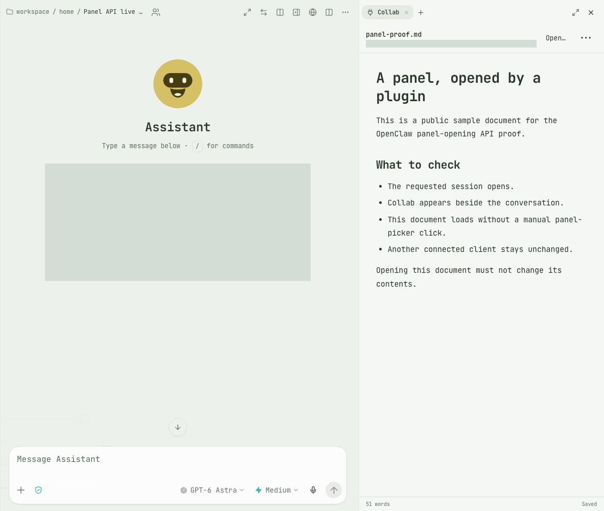

# Live proof: plugins opening their session panels

Captured on October 2, 2026 against a running OpenClaw Gateway for [openclaw/openclaw#163428](https://github.com/openclaw/openclaw/pull/163428).

**Both SDK paths opened the real Collab panel. A second connected Control UI client stayed unchanged.** The sample Markdown file was not modified. No Gateway rebuild, restart, or plugin reload was performed for this proof.



The images show the actual Control UI. The navigation sidebar is outside the capture; the recent-session list and absolute workspace path are masked. The document is a [public sample](../../examples/panel-proof.md), not a private working document.

## Results

| Check | Observed result |
| --- | --- |
| Backend `api.runtime.gateway.openPluginPanel(...)` | An authenticated `tools.invoke` call to the installed plugin's `collab_open` returned `ok: true`, with `source: plugin`. The requesting client received one `ui.command` for `collab/document`, and the editor rendered the expected document heading. |
| Requester-only delivery | A second real WebSocket client was connected to the same proof session. It received zero panel-open commands and did not open Collab. A read RPC on that client provided a transport barrier before checking its final state. |
| Browser `host.ui.openPanel(...)` | Navigating through Collab's actual open-document page called the plugin's file-open action, then moved from `/plugin` back to the requested session with Collab visible. One local plugin-panel event was observed; no backend `ui.command` was needed for this path. |
| Plugin ownership | Calling the Collab host's `openPanel` with `context-explorer`—a panel owned by another loaded plugin—threw `A plugin can open only its own registered panel.` |
| File integrity | SHA-256 was `72a9b2347221daf4f487959cfe2d42c1e986681ecda0ee5a438208accd8ae897` before and after. |
| Browser errors | No page errors were observed during either successful path. |

The [captured results](results.json) retain the command payload, route transitions, panel event, service action names, file hashes, and runtime identity.

## Screenshots

- [Before: no Collab panel](01-before.png)
- [After the backend plugin-tool call](02-backend-open.png)
- [Second client: unchanged](03-observer-unchanged.png)
- [After browser-side navigation through the plugin page](04-browser-navigation.png)

## Runtime and scope

- Running version: `2026.9.7`.
- Running build: `2026.9.7-16d7e99487b5-2026-10-02T07-12-27.499Z`.
- The development checkout was at `16d7e99487b589a88a9fd737ed409119e9b44df5` with uncommitted changes. The Gateway remained on the same process throughout the proof.
- The local bodies of `openPluginPanelForRequester` and `host.ui.openPanel` matched both the initial PR head `9a8891cbe87da63b3e001cd87962c41f69119839` and the later head `75d0e25d1375f05b93d0939f8e178c4ec03bc35c`, ignoring whitespace. The intervening commit changed only the Gateway test file. This is **not** a clean-checkout test of the entire PR head.
- The external Collab implementation is the one published in [openclaw/collab at c05ba1d](https://github.com/openclaw/collab/tree/c05ba1d74d4e2596bbf402615049b4ba684442bb).

This proves live plugin-tool dispatch, requester-targeted transport, navigation, and rendered panel loading. The backend call was made directly over the authenticated Control UI connection, not selected by a model in a new agent turn. The second client used the same operator identity; this is not a cross-user authorization test. Retirement, revoked permissions, disconnected requesters, and every navigation race were not exercised by this capture; see the PR's focused tests for additional coverage.

## Reproduce

Use a host with the PR's APIs and Collab installed. Open a dedicated empty session in two Control UI clients, leaving the Collab panel closed in both.

1. Place the [sample Markdown](../../examples/panel-proof.md) inside the agent workspace.
2. From client A's authenticated Gateway connection, invoke the real plugin tool:

   ```js
   await client.request("tools.invoke", {
     name: "collab_open",
     args: { path: "collab/docs/examples/panel-proof.md" },
     sessionKey: proofSessionKey,
   });
   ```

3. Observe client A's `ui.command` frame and the rendered document. Client B should receive no such command and keep its panel closed. Read the file again and compare its hash.
4. Close the panel. Use **Copy Collab link**, or the plugin's public navigation helper, to open its `open` page with the sample path and proof-session key. This exercises Collab's browser-side call to `host.ui.openPanel` after the file-open action.
5. Confirm the route returns to that session, Collab renders the same document, and client B stays unchanged.

The proof used Playwright/CDP only to drive and observe the existing UI. It did not mock the service, replace the SDK, synthesize a success response, dispatch a fake panel event, or start an agent run.
